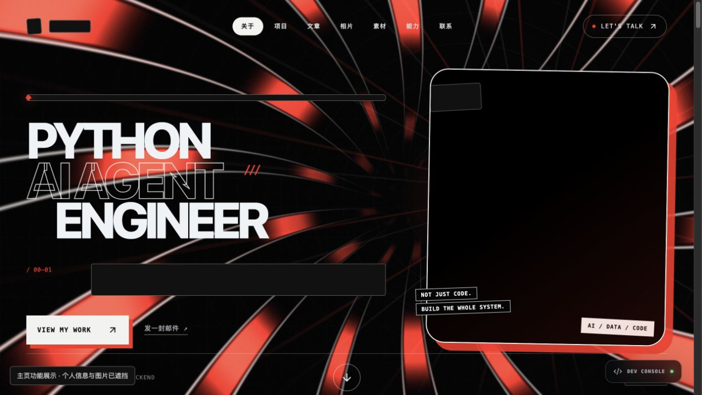
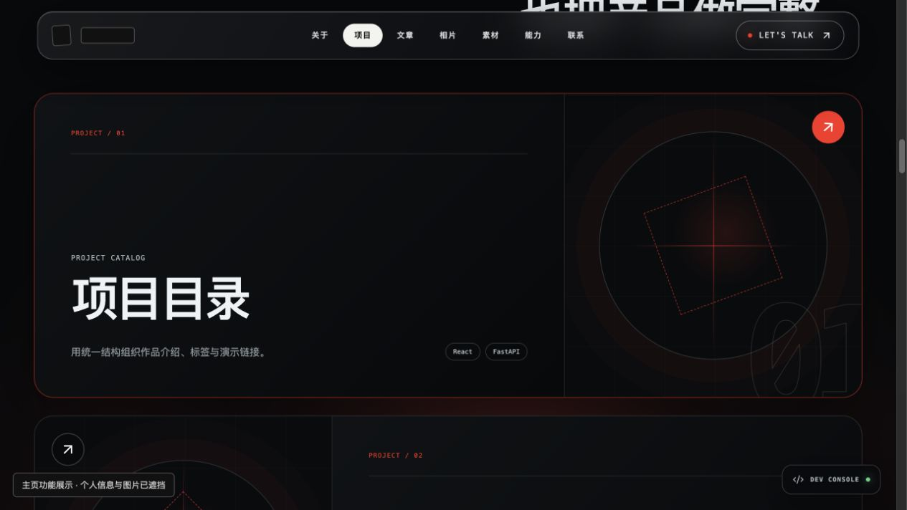
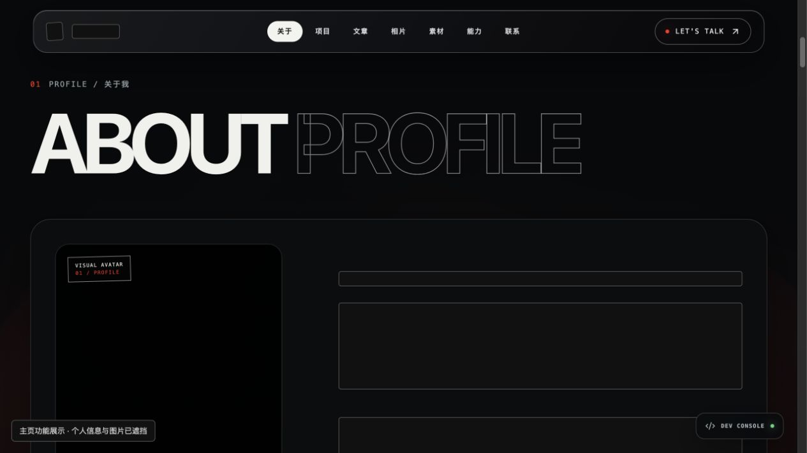
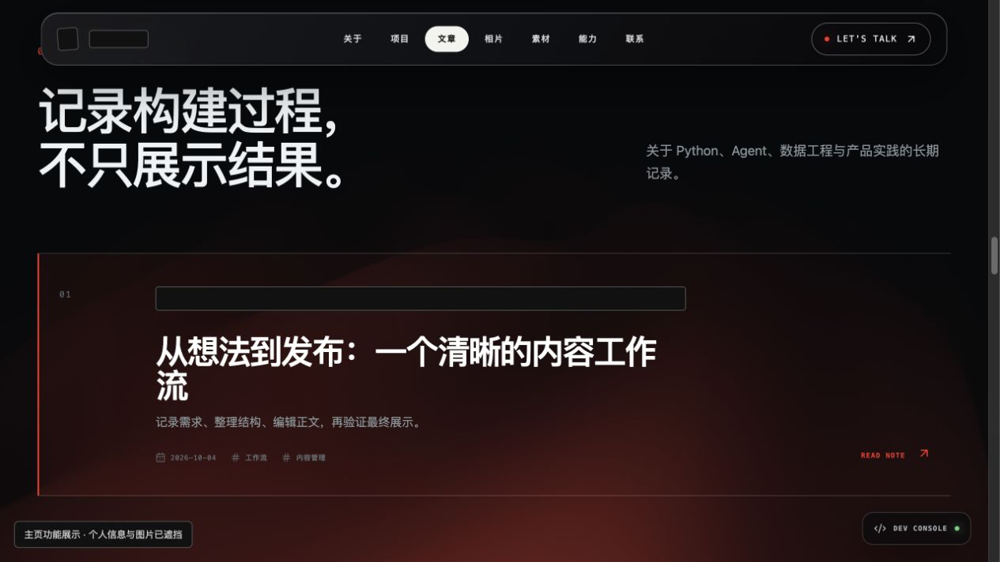
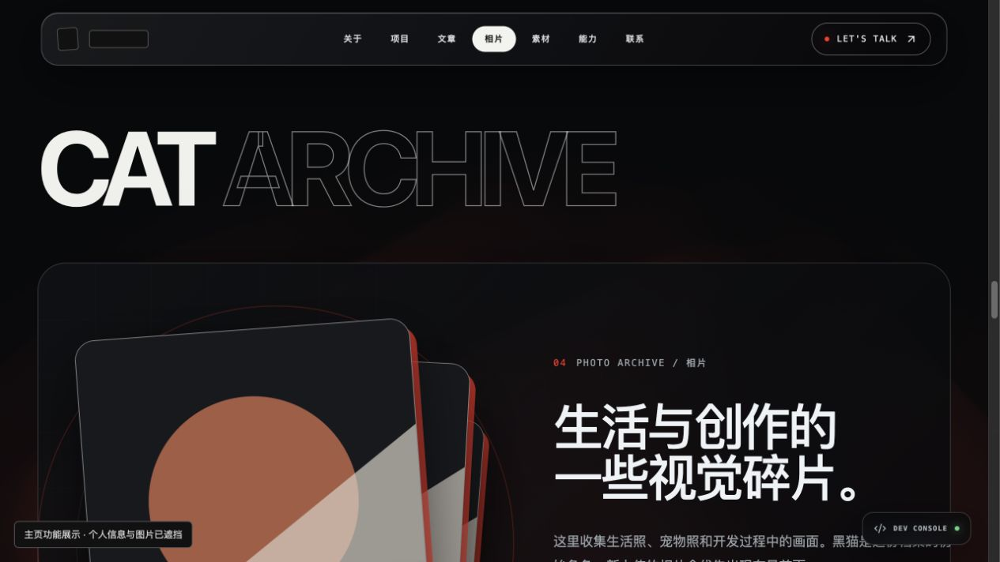
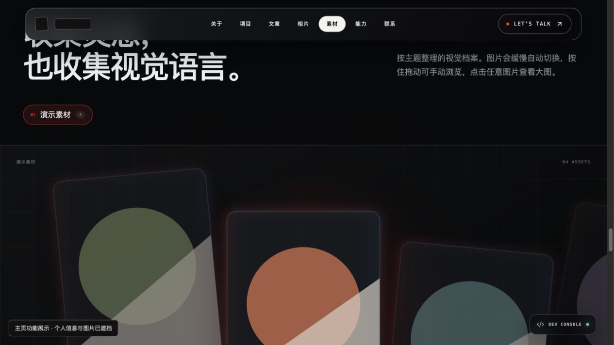
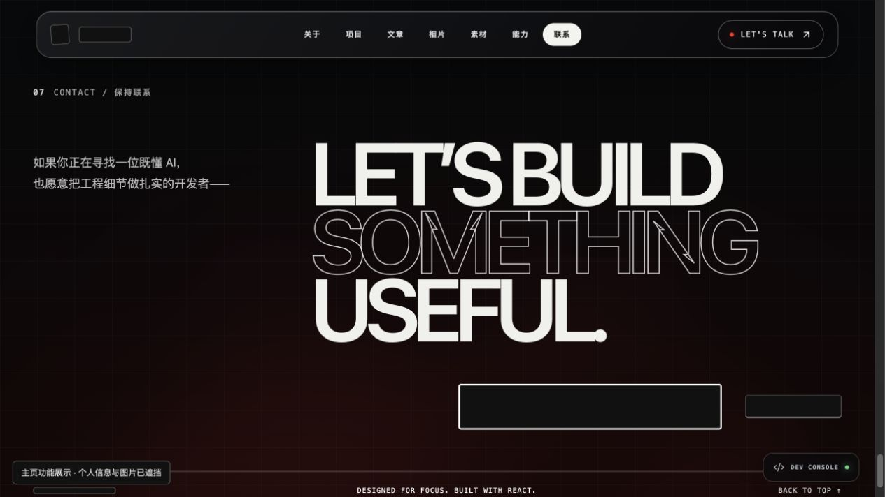
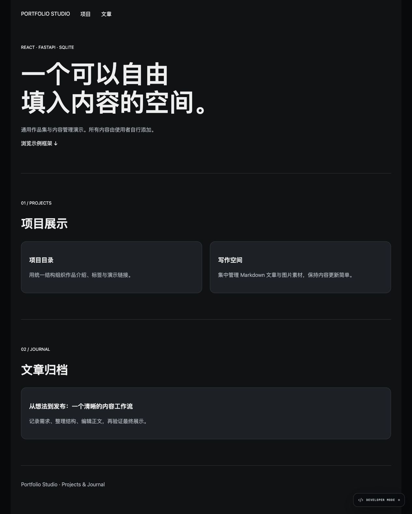
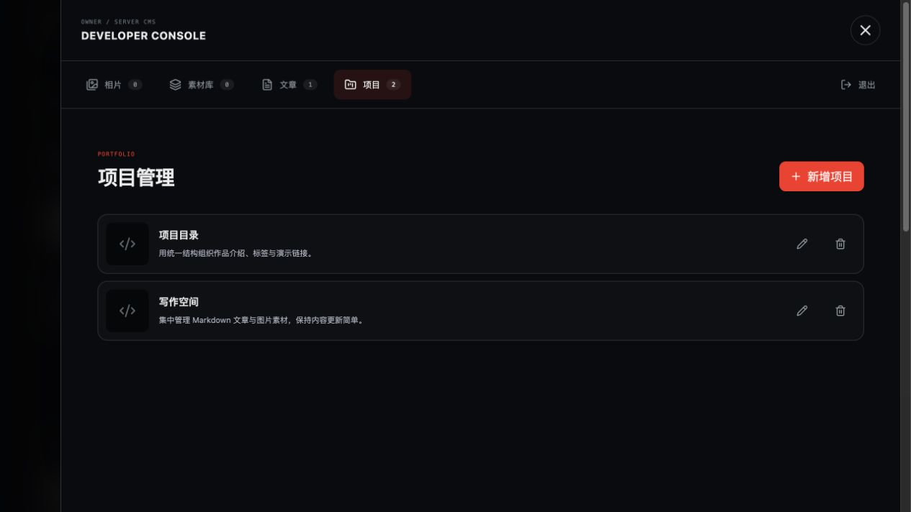
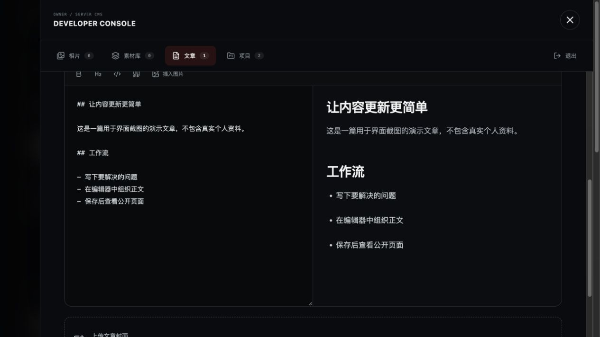

# Portfolio Studio

**一个用于管理作品项目、技术文章与图片素材的全栈个人网站。**

Portfolio Studio 将公开展示页面与内容管理后台放在同一个项目中：访客可以浏览项目和文章，维护者可以通过浏览器编辑内容、上传图片和管理素材，无需为每篇文章修改 React 源码。适合需要独立部署作品集和写作空间的开发者、创作者及设计师。

项目使用 **React + Vite** 构建界面，**FastAPI** 提供内容与认证接口，**SQLite** 保存结构化数据。前后端通过 `/api` 通信，开发时可以用一个命令同时启动。

## 完整主页功能展示（已打码）

以下为完整版主页在本地临时环境中的运行截图：个人信息与原始图片已作不透明遮挡，项目、文章、相册及素材使用临时示例内容。仅提交处理后的截图，不提交原始截图、个人数据或私人素材。当前公开源码使用通用首页，下方“公开版本运行截图”展示其实际界面；本节展示完整版主页的布局与交互模块。

### 全屏 Hero、导航与联系入口



### 精选项目大卡片



<details>
<summary>展开查看介绍区、文章、相册、素材轮播与收尾页</summary>

### 介绍区与资料卡片



### 文章归档



### 堆叠相册



### 分组素材轮播



### 整屏联系收尾



</details>

## 公开版本运行截图

以下图片来自本地实际运行的公开版本，使用临时示例项目和文章；演示数据库、账号及凭据不随仓库分发。首次安装仍以空内容启动。

### 首页：项目展示与文章归档



### 内容管理：项目列表



### Markdown 编辑器：正文编辑与实时预览



## 项目解决什么问题

静态作品集往往需要修改代码才能更新项目和文章；完整博客平台又可能超出个人站点的维护需求。本项目提供一套较轻量的工作流程：在开发者控制台填写内容，保存到数据库，再由公开页面读取并展示。图片由后端处理后保存到磁盘，内容与界面代码可以分别维护。

## 已实现功能

| 模块 | 能力 |
| --- | --- |
| 公开页面 | 首页、项目列表、文章列表，以及点击后展开的正文阅读区域 |
| 项目管理 | 编辑标题、副标题、介绍、Markdown 正文、标签、链接、封面及截图 |
| 文章管理 | 编辑标题、摘要、日期、标签、封面、截图和 Markdown 正文 |
| 图文编辑器 | 工具栏、实时预览，以及在光标位置上传并插入图片 |
| 相片与素材管理 | 管理相片、素材分组、批量上传及下载素材 |
| 图片处理 | 校验文件类型和大小，转换为 WebP，最长边限制为 1800px |
| 管理员认证 | 单管理员初始化、登录、退出与 Cookie 会话 |
| 内容迁移 | 导出内容快照与引用图片，向新环境导入；拒绝覆盖已有站点 |
| 自动检查 | GitHub Actions 执行前端构建和隔离数据库测试 |

当前公开首页展示项目和文章；相片与素材通过后台管理。源码还包含相片堆叠、轮播、动效和详情页组件，供后续扩展，目前并未全部接入公开首页。

## 架构

```text
访客 / 管理员
      │
      ▼
React 页面与开发者控制台
      │ /api（内容、登录、上传）
      ▼
FastAPI
      ├── SQLite：文章、项目、素材分组、账号与会话
      └── 本地磁盘：处理后的上传图片
```

公开读取与管理员写入分开：访客读取内容不需要登录，保存内容和上传图片需要管理员会话。密码采用 PBKDF2-SHA256 哈希；会话有效期为 7 天，Cookie 设置 HttpOnly 和 SameSite。

## 快速开始

环境要求：**Node.js 22、Python 3.11+**。以下命令适用于 macOS/Linux。

```bash
git clone https://github.com/agentwinwinwin/portfolio-studio.git
cd portfolio-studio
npm ci
python3 -m venv .venv
.venv/bin/python -m pip install -r backend/requirements.txt
npm run dev
```

| 服务 | 地址 |
| --- | --- |
| 网站 | http://127.0.0.1:5173 |
| API | http://127.0.0.1:8000 |
| 交互式 API 文档 | http://127.0.0.1:8000/docs |

首次运行后，点击页面的 **DEVELOPER MODE** 创建本地管理员。登录后添加文章或项目，保存并退出控制台，即可在页面中查看。

仓库以空内容启动，没有预装个人资料或图片。若需要使用仓库中的内容快照，在首次启动服务之前运行：

```bash
.venv/bin/python scripts/content_bundle.py import
```

导入仅适用于尚未初始化的新环境；已有内容、账号或上传文件时会拒绝执行。

Windows 安装与导入时将 Python 路径替换为 `.venv\Scripts\python.exe`；开发启动脚本支持该虚拟环境路径，尚未在 Windows 实机验证。

## 开发与验证

```bash
# 同时运行前端和后端
npm run dev

# 构建前端
npm run build

# 验证内容迁移、覆盖保护和快照结构
.venv/bin/python -m unittest discover -s tests

# 导出当前站点内容与引用图片
.venv/bin/python scripts/content_bundle.py export
```

导出只包含前台内容和引用图片，不包含账号与会话。新增内容是否适合公开，需要由维护者检查；完整私人备份仍需同时保存数据库和上传目录。

## 目录结构

```text
src/
  App.jsx                   公开展示页面
  components/               控制台、Markdown 编辑器及展示组件
  lib/                      内容请求与认证客户端
backend/
  app.py                    API、认证、数据库及图片处理
  requirements.txt          Python 依赖
content/site-content.json   可导入的内容快照
scripts/                    开发启动与内容导入导出
tests/                     内容迁移自动检查
docs/                      部署与发布说明
.github/                    CI、Issue 和 PR 模板
```

运行时生成的 `backend/data/`、`backend/uploads/`、环境文件、依赖和构建目录均通过 `.gitignore` 排除。

## 部署

推荐使用同一 HTTPS 域名：Nginx 提供构建后的 `dist/`，将 `/api/` 转发至 FastAPI，数据库和图片使用持久化目录。文章与项目编辑功能需要 Python 后端，不能只用 GitHub Pages 托管整个应用。

配置项及反向代理示例见 [部署说明](docs/DEPLOYMENT.md)。上线前应设置强管理员密码、启用 HTTPS Cookie，并完成依赖安全更新。

## 当前边界

这是单管理员、单实例站点，尚未实现多用户权限、登录限速、密码找回和独立 CSRF token。测试覆盖内容迁移的关键行为，尚未覆盖整个界面的端到端流程。当前 Vite/esbuild 依赖存在已知审计问题，详见 [发布检查](docs/RELEASE_CHECKLIST.md)。

## 贡献与许可

贡献流程见 [CONTRIBUTING.md](CONTRIBUTING.md)，安全问题处理见 [SECURITY.md](SECURITY.md)。自有代码使用 [MIT 许可证](LICENSE)；第三方组件和依赖遵循各自许可，尤其 React Bits 的附加限制，见 [第三方许可说明](THIRD_PARTY_NOTICES.md)。

文档组织参考 [FastAPI 官方全栈模板](https://github.com/fastapi/full-stack-fastapi-template)，部分交互组件参考 [React Bits](https://github.com/DavidHDev/react-bits)。
